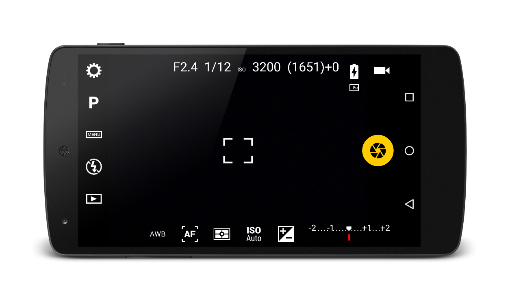
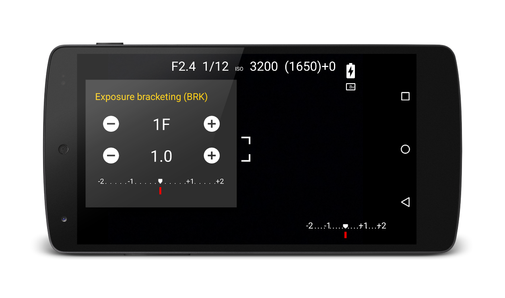
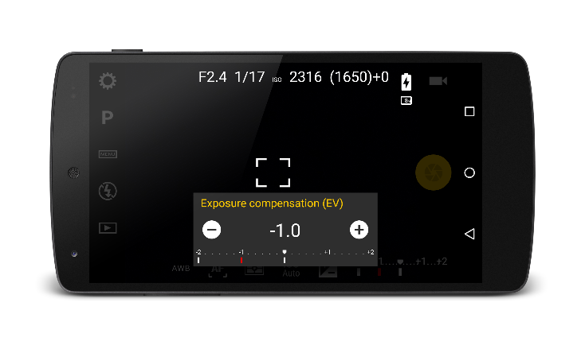

# Automatic exposure bracketing

Camera FV-5 has a built-in exposure bracketing feature. Bracketing means taking multiple shots varying some parameters between them. Therefore, exposure bracketing produces multiple shots with different exposures. On other DSLR cameras, this feature is known as BRK or AEB (auto exposure bracketing).

Exposure bracketing is useful to:

* Capture a photo with good exposure when you don't know the correct exposure beforehand, or you think that you would need to change the exposure after taking the photo.
* Capture a broader dynamic range scene: either you can expose for a bright area or a dark area but not both. Later, with the bracketed pictures, you can make a HDR picture on the computer, or using other applications.

This is the Camera FV-5 interface, when bracketing is not activated:

Notice the exposure meter on the lower right corner. The red mark shows the current exposure compensation. At +0 EV, the exposure is at the automatic metered speed.

Now, tap on [MENU] icon at left bar, then BRK. The bracketing settings dialog will open:

The dialog contains the following settings:

* Number of shots. Is the total number of shots to be taken. You can take from 3 up to 7 frames. You can tap on the + and - buttons to increase/decrease the number of bracket frames. In the display you will see either 1F, 3F, 5F or 7F, depending the number of frames. 1F means bracketing is disabled.
* Exposure step. Is the exposure compensation step between frames. The smallest EV step is device dependant, but a typical value is half stop (0.5). However, there are devices with 1/3 EV and 1/6 EV step too.

!!! note
    With exposure compensation. Exposure compensation affects the exposure compensation of the central photo, and hence the rest of the bracketed photos. EV compensation plus bracketing lets you to take multiple dark or multiple bright pictures, depending of the sign and magnitude of the EV shift.
    
    

When you are done adjusting the number and step of the bracked pictures, dismiss the dialog by tapping outside it. Check the number and exposure of the pictures to be taken on the exposure meter at the lower right corner.
