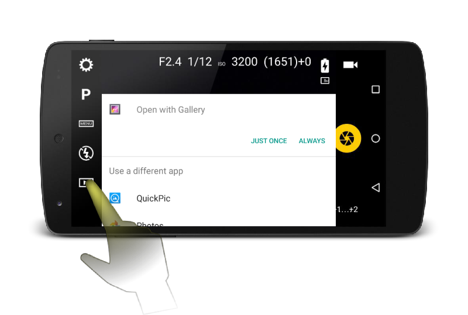

# Image review

Camera FV-5 has a built-in gallery to review the photos you take. By default, Camera FV-5 will use its built-in gallery.

To review the last taken photo, tap on the _playback_ button (or the thumbnail of the photo) on bottom of the left side of the screen to open the gallery.

## Built-in gallery

The built-in gallery provides the basic functions for you to review your images.

The functions include:

* Swipe images to the left or to the right in order to browse your selected photo storage folder.
* Pinch to zoom in and out.
* Double tap anywhere on a photo to zoom in at 100% magnification on that particular spot.
* Single tap anywhere to toggle the full screen mode. In full screen mode, the background turns black, and the toolbar is hidden.
* On the __gallery toolbar__:
    * __Zoom on the next face__. If faces are detected on the current photo, tap on this button to make the first face fill the entire screen space. Tap again to zoom on the rest of the detected faces. When the face is shown, the first one will be shown again. Use this function to quickly review face focus and spot blinking eyes.
    * __Share__ the current photo with any external app. A menu will be shown displaying all compatible apps.
    * __Edit__ the current photo on any external image editor installed on the phone.
    * __Delete photo__. Tap on the button, and then tap again on the red menu to confirm.

In the left side of the toolbar, the current file name is displayed, along with an icon that displays the type of format this photo is recorded in: JPEG, or JPEG+RAW.

!!! note
    The gallery only displays JPEG or PNG images in case a RAW version exists as well. Given speed and resources limitations, the RAW image cannot be previewed on the gallery, so the JPEG or PNG image is required in this case.

Press the back key or the arrow in the top-left corner of the screen to return to the camera.

## Use an external gallery

If you prefer, you can use any external image gallery app on your phone to review your images instead of using Camera FV-5's built-in one. To do so, go to `Settings > General camera settings tab (2nd)`, and enable the option `Prefer external applications`.

Then opening the gallery, Camera FV-5 will invoke any external image viewer you have installed on your system. By default, almost any Android device have a gallery application preinstalled. Other phones have also the Photos app by Google. In any case, you can preview the last image taken on any of these external application, and then you can either come back to Camera FV-5 or you can flick over all the other pictures besides the last one.

In case there are more than one application available to view images on your phone, you will see a dialog that lets you choose which application you can to use. Furthermore, you can either use one application just once, or assign this application as the default one for viewing images.

 
In case you want to reset an app set previously as "by default" so that you get asked again which one you want to use, you can reset the association on `Android settings > Application manager / Apps > All > [Current default gallery application] > Launch by default > Clear defaults`.
