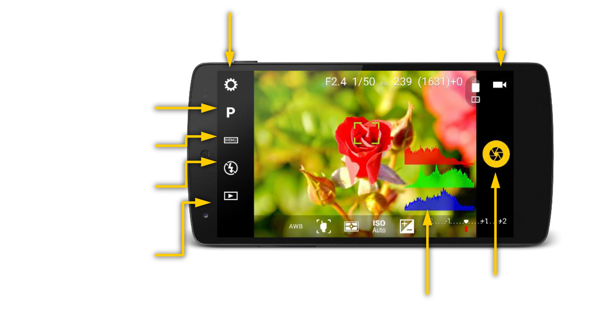
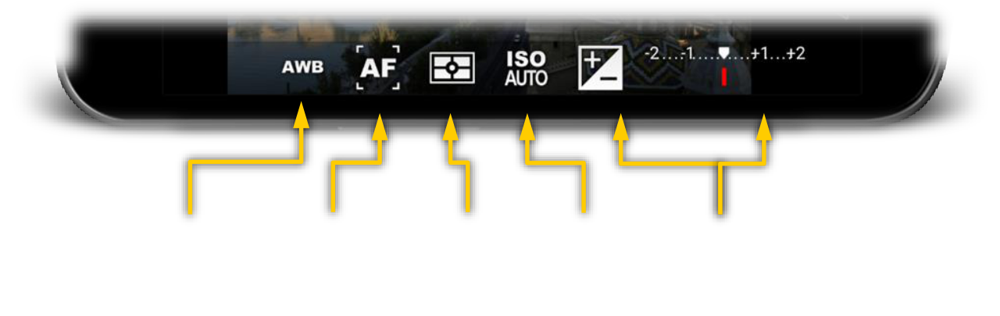
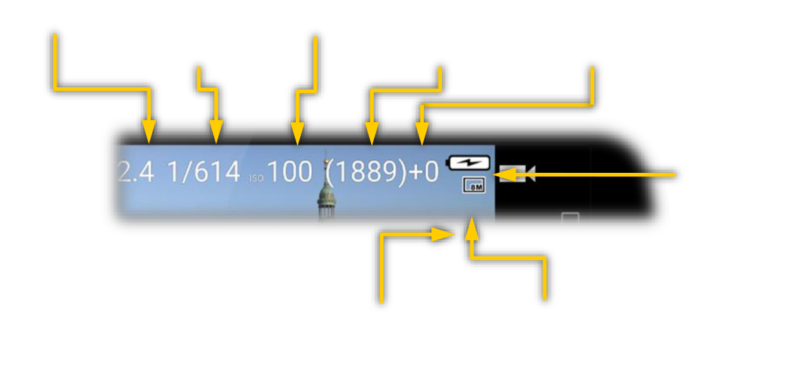

# Basic commands

Camera FV-5 puts all the controls and options —that you would typically find on dedicated physical buttons on a high-end DSLR camera— directly on the screen. Adjusting the ISO, the metering mode or the white balance is just a tap away. All the controls are located around the viewfinder.

---

---

