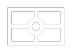
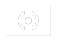

# Main photographic controls

The main photographic controls —exposure compensation (EV), ISO, light metering mode, focus mode and white balance (WB)— are always available at the bottom of the screen. Changing those parameters is a breeze: they are just two taps away, and you always get a preview of the effects reflected on the viewfinder.

|  |  |  |  |  |
| :---: | :---: | :---: | :---: | :---: |
| __White balance__ | __Focus mode__ | __Light metering mode__ | __ISO__ | __Exposure compensation__ |

!!! tip
    You can reset altered photographic parameters to their defaults by long-pressing on their corresponding buttons. The device will produce a short vibration to confirm that the setting was reset to its default and the icons will also reflect the change. White balance is reset to AWB, focus mode to AF, metering mode to matrix, ISO to Auto and exposure compensation to +/- 0.

## Exposure compensation (EV)

Adjust the compensation of the exposure time. A value of +1 effectively doubles the exposure time, whereas a value -1 halves the exposure time. The EV range and step vary across devices. A range of [-2, 2] and a step of ½ stop is typical. If exposure bracketing (BRK) is enabled, the exposure compensation will compensate the bracketing exposures, and the bracketing number of pictures and step will limit the EV range. Read more on this on chapter Automatic exposure bracketing (p. 37).

## Sensor sensitivity (ISO)

Select the ISO value: automatic (AUTO) or in the range from ISO 50 to ISO 3200, depending on the device (some sensitivities may not be available, or may take no effect if Camera FV-5 is unable to detect the available ISO range of your device).

## Light metering modes

Select which zones to use from the picture to meter light. The available options are:

| Symbol | Description |
| ------ | ----------- |
|  | __Matrix.__ Use all zones to meter light. |
|  | __Center.__ Use the central part of the picture to meter light. |
|  | __Point.__ Use the area of the focus rectangle when it is centered on the viewfinder. In case you are using touch-focus (i.e. the focus rectangle is not centered) the metering point will still be centered. If you want point metering, but not centered, you can use __touch metering__ (if available).
|  | __Touch metering.__ Allows you to select the metering point from any point on the picture. This option is only available on devices whose camera hardware supports this feature. The metering point is chosen by long-pressing on the viewfinder (if touch-metering is not available, long-pressing on the viewfinder will have no effect). Then, a metering rectangle will appear. This rectangle can be dragged around the viewfinder with the finger once is placed on a specific position. You can reset the metering mode by selecting any of the other metering modes (matrix, center or point). |
|  | __Auto-exposure lock.__ Stops the automatic exposure algorithm, keeping the last automatic exposure time calculated while the lock is active. Tap the toggle again to unlock. Supported only on Android 4+ devices with the appropriate support from the camera hardware. |

## Focus mode

You can choose from one of the following focus modes, plus a focus lock switch.

| Symbol | Description |
| ------ | ----------- |
|  | __Autofocus.__ Focus anywhere on the picture. Focus priority depends on camera maker. Tap anywhere on the viewfinder to trigger AF. |
|  | __Manual focus.__ Available only on Android 5+. The focus rectangle is hidden, and you can slide vertically the finger over the viewfinder to adjust manually the focus position between infinity and macro. |
|  | __Macro.__ Gives AF system a hint to prioritize closer objects. On some devices, effectively lowers the allowed minimum focusing distance. |
|  | __Face detection focus.__ The focus rectangle is hidden, and the focus is automatically adjusted to be positioned on faces, that are automatically detected in real time in the viewfinder. |
|  | __Touch focus.__ Gives AF system a hint to focus on the selected object. Tap anywhere on the viewfinder to select the focus point and trigger AF. Touch focus, under Android 2.x, is only available on some Motorola, HTC and Nvidia camera drivers, plus some Samsung drivers. Android 4.0+ it is always supported. |
|  | __Continuous autofocus.__ The focus is automatically and continuously adjusted according to the camera autofocus mode criteria. |
|  | __Infinity.__ Set the focus to infinity. Tapping on the screen always result in focus confirmation and AF is not triggered. |
|  | __Autofocus lock.__ Locks the focus at the current position. Tap the toggle again to unlock. |

## White balance (WB)

You can compensate white biasing because of different illuminant temperatures. As of now, you can choose from different presets (ordered from warmer to colder temperatures):

| Symbol | Description |
| ------ | ----------- |
|  | __Automatic.__ The camera calculates the temperature of the light source present on the scene and automatically compensates it. |
|  | __Cloudy.__ |
|  | __Sunny.__ |
|  | __Fluorescent light.__ |
|  | __Warm fluorescent light.__ |
|  | __Incandescent light.__ |
|  | __Auto white balance lock.__ If the white balance is set to auto, when the toggle is active, the automatic white balance algorithm will stop running, keeping the last calculated scene temperature. Tap again the toggle to unlock it and recalculate the scene color temperature. |

!!! note
    Preset white balance settings depend on device manufacturer support.
