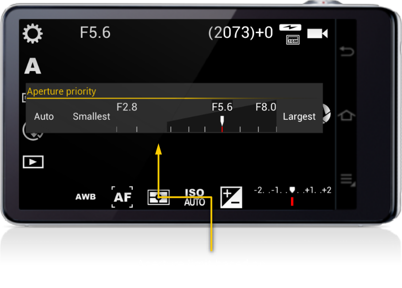

# Aperture priority

Let's you set the lens aperture manually.

!!! note
    The Aperture priority mode (A) only applies to real cameras (not mobiles phones). The aperture is not adjustable on mobile phones because mobile camera modules have a fixed aperture. The aperture of the lens depends approximately on the diameter of the lens. Conventional cameras with adjustable aperture have blades that close or open to reduce or increase the amount of light reaching the sensor, respectively. Those blades usually have the look of the virtual shutter icon button that used on the app, but ironically, mobile phones doesn’t have such blades, nor any kind of device that is able to close the diameter of the aperture. Therefore, the aperture is inherently fixed on those camera modules, and therefore, no application will be able to control the aperture. The aperture (F-number) shown is queried to the camera driver, and it is also the maximum aperture, as, given the diameter of the lens, cannot be larger, without building the lens differently.

The range of apertures available depends on the characteristics of the lens. You can drag the marker over the aperture scale to adjust the aperture F number. The selected value will be displayed on the top of the viewfinder.

!!! note
    The maximum aperture (minimum F/number) you can select depends on the actual focal length (zoom value). You can see the maximum aperture you can select on the aperture scale.