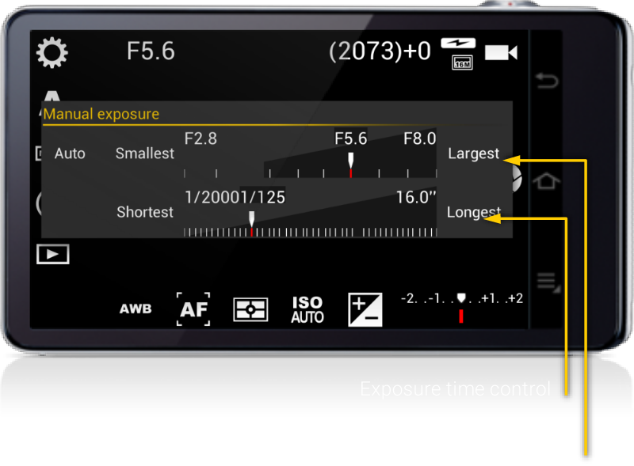

# Manual

The dialog lets you select both the aperture and the exposure time simultaneously. Therefore depending on the specific combination you choose you can end up with underexposed or overexposed photos. Both the exposure time and aperture scales are the same as in their individual selection dialogs. You can preview the final exposure in the viewfinder as soon as you adjust the scales.