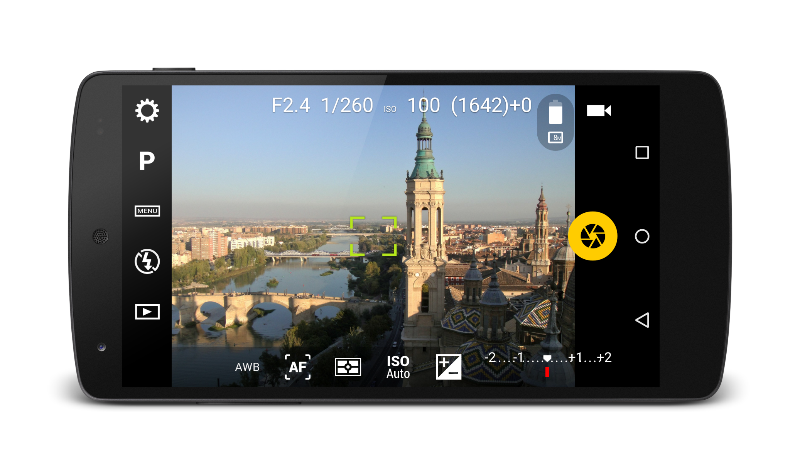

# Introduction

Camera FV-5 is an advanced camera application for Android devices. Currently it runs on mobile phones, tablet computers and Android-powered cameras. It brings the camera control typical from advanced point&shoot and DSLR cameras, control that is missing from stock firmware and OEM camera applications. It squeezes every ounce of your camera by providing a unique hardware abstraction layer that it is able to control camera modules of more than 14,000 models of phones, tablets and standalone cameras. All devices are supported by the same application. Given the big differences among all the devices Camera FV-5 is able to run on, the controllability of those devices also varies significantly. This is discussed through this manual.

Tailored to enthusiast and professional photographers, with this camera application you can capture the best unprocessed photographs so that you can post-process them later with as much quality as possible and get stunning results. The only limit is your imagination and creativity!