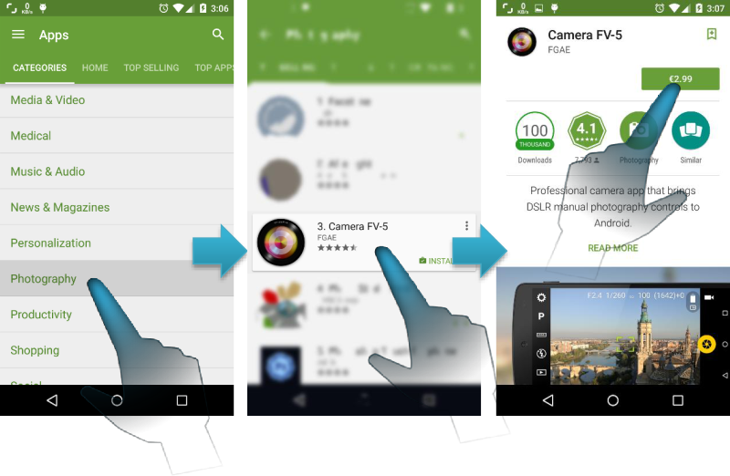

# Installing Camera FV-5

Camera FV-5 is available through Google Play, the marketplace for Android applications. Google Play is preinstalled on all Android devices. You can find Camera FV-5 on the top positions of the “Photography” section, as well as searching for “Camera FV-5”.

There are two versions of Camera FV-5: **Camera FV-5 Lite** and **Camera FV-5** (_paid version_). Both versions are essentially the same, with the only difference being the resolution limitation on the free Lite version. Therefore you can try the application without any time limitations and see if the application works properly and fits your demands before buying the full paid application.

Regardless of the version of the application you download, you have access to frequent updates. You get those updates by either manual download (you get notifications on the Android notification drawer when updates become available) or automatically if you decided to do so. It is recommended that you select automatic application updates. You always get the most stable version and newer features without having to care to download updates manually. After each update, a dialog will tell you what’s new on the updated version (new features, bug fixes and improvements). Application updates are also free once bought the paid version as well. Therefore, buying the application is a one-time payment, granting you access to all future updates at no extra cost.

Furthermore, when you buy the application, **you can install Camera FV-5 on all your Android-powered devices at no extra cost**. To do that, be sure to always download the application using the same account you used for buying it on the first place. On that case, you won’t be prompted to pay again each time you install the application on the same or other devices you might own.