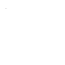
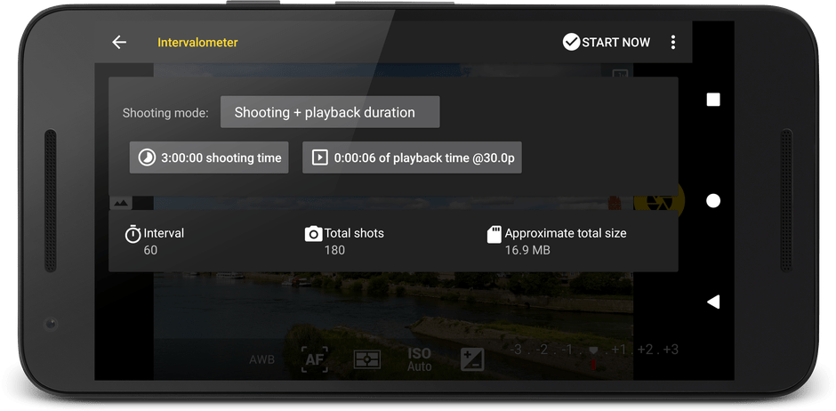

# Usage and configuration

The intervalometer is located under the button:

at the left side of the viewfinder, under the icon pictured as:

## Configuration

The intervalometer can operate in different shooting modes. You can select which one you want to use by tapping on the button and choosing one of the following:

* __Interval + total shots__. In this mode, the _interval_ (in seconds between photos) and the _total number of photos_ can be set. As reference, the _finalization time_ will be shown, as well as the _playback time_ in case the photos are compiled into a clip.
* __Interval + shooting duration__. In this mode, the _interval_ (in seconds between photos) and the _total shooting time_ (in hours, minutes and seconds) can be set. As reference, the _total number of shots_ required to meet these criteria will be calculated, as well as the _playback time_ in case the photos are compiled into a clip.
* __Interval + playback duration__. In this mode, the _interval_ (in seconds between photos) and the _total playback time_ if the photos are meant to be compiled into a video clip (in hours, minutes and seconds) can be set. As refence, the _total number of shots_ required to meet these criteria will be calculated, as well as the _finalization time_.
* __Shooting + playback duration__. In this mode, the _total shooting time_ (in hours, minutes and seconds) and the _total playback time_ if the photos are meant to be compiled into a video clip (in hours, minutes and seconds) can be set. As reference, the _interval_ (in seconds) and the _total number of photos_ required to meet these criteria will be calculated.
* __Shooting duration + total shots__. In this mode, the _shooting time_ and the _total number of photos_ can be set. As reference, the _interval_ (in seconds) and the _playback time_ (in hours, minutes and seconds) —if the photos are meant to be compiled into a video clip— can be set.

!!! note
    The _frames per second_ needed to calculate this can be set by pressing the three vertical dots icon, and selecting _Define playback frames per second..._.

Regardless of the shooting mode chosen, there will be two parameters to set. In order to set them, tap on the corresponding button to set the desired value.

## Usage

To start the intervalometer, tap **Start now**, on the top right corner of the screen. Then, the intervalometer dialog will disappear, and a toolbar will be shown with information about the progress (current shot/total shots) and the expected remaining time based on the specified time interval. Two buttons let you pause/resume the intervalometer, and stop it.

All settings are available when taking photos with the intervalometer. Even more, if exposure bracketing is enabled when starting the intervalometer, all the bracketed exposures will be taken and they will count as one shot for the intervalometer. You can use this feature to create HDR timelapses by grouping bracketed exposures taken during an intervalometer session.

!!! warning "Important"
    If the time interval between shots is shorter than the time needed to create the shot(s), one or more picture slots will be omitted, effectively lowering the number of pictures finally taken. Take care to properly measure/calculate the time needed to create the shot(s), specifically when exposure bracketing is enabled.

There is the option to **refocus before every shot** taken as part of the series. You can find that option in the three vertical dots button in the top right corner of the screen (a menu will be displayed). That option is disabled by default, and that is the recommended setting. In order to achieve consistent focus between shots, set the focus before entering the intervalometer to lock it. If for any reason the focus cannot be locked, or refocusing before each shot is required, enable that option.

!!! note
    Settings desired for the picture series, specifically picture focus, must be set prior starting the intervalometer. When the intervalometer starts, the AF is not triggered. However, you can still tap on the viewfinder to manually trigger the AF system while the intervalometer is running. Focus misadjustments can affect the subsequent pictures. To avoid accidental focus changes during intervalometer operation, activate the focus lock (AF-L).