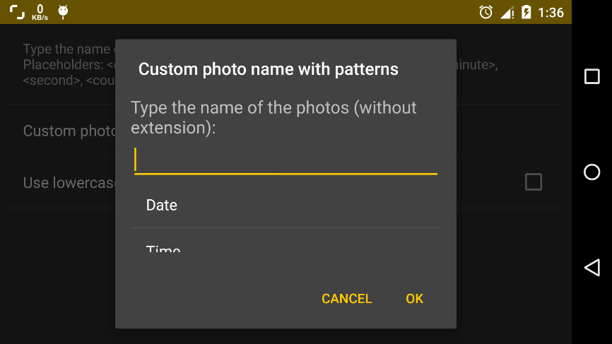

# File names

By default, photos are named according to the DCIM standard (photos stored in a folder with the session number with 3 digits and a 5 letters suffix, 100_CFV5, and photos named with a 4 letters prefix and 4 digits counters, DSC_0001.JPG). That is the standard that follows most compact digital cameras and all DSLR cameras. It allows printers and other devices to automatically locate sessions and photos. However, you might want to change the file names to suit your needs, although they don’t follow the DCIM standard any longer.

## Custom prefixes

In `Settings > Photo encoding settings > Photo storage & Numbering > Photo numbering pattern` you can set the file name to one of the following patterns (all of them complying with the DCIM standard):

* __DSC_####.JPG__
* __DSC0####.JPG__
* __IMG_####.JPG__
* __PI_CT####.JPG__
* __Custom.__ This one lets you customize the prefix with the 4 letters of your choice (for instance your initials or the four first letters of your name). After setting this option, tap on the Custom photo prefix setting and type the 4 letters of the prefix. If you provide less than 4, the prefix will be padded with underscores (“_”) to fill 4 letters, and if you provide more, the first 4 will be taken.
* __Custom with patterns.__ More on this on the next section.

## Custom file names with patterns

If need more customization of the file naming scheme, you can select the option Custom with patterns in the setting Photo numbering pattern. Then, go to Custom photo name with patterns option and another panel will open. Tap on Custom photo name with patterns to compose your own pattern.

The file name pattern is composed of fixed and dynamic text. For instance, the file naming scheme **DSC_####.JPG**, has a fixed part (“DSC_”) and a dynamic part (the photo counter).

The dynamic part of the name pattern is specified with placeholders, which are pieces of special text that are replaced with their corresponding values in the moment of saving the picture (when the file name is created). Those special pieces of text (placeholders) are written between angle brackets and are:

* `<date>`. Prints preformatted date. E.g. `2001-12-31`.
* `<time>`. Prints preformatted time. E.g. `13-20-20`.
* `<day>`. Prints the current day with 2 digits. E.g. `31`.
* `<month>`. Prints the current month with 2 digits. E.g. `12`.
* `<year>`. Prints the current year with 2 digits. E.g. `01`.
* `<year4>`. Prints the current year with 4 digits. E.g. `2001`.
* `<hour>`. Prints the current hour with 2 digits in 24-hours format. E.g. `13`.
* `<minute>`. Prints the current minute with 2 digits. E.g. `20`.
* `<second>`. Prints the current second with 2 digits. E.g. `20`.
* `<counter>`. Prints the current photo counter with 4 digits. E.g. `0001`.

Furthermore, it is possible to control the case (uppercase of lowercase) of the file extension in this mode by using the option **Use lowercase extension**.

Some examples of custom patterns:

* `<date>_<time>` would produce `2001-12-31_13-20-20`.
* `<day><month><year><hour><minute><second>` would produce `311201132020`.
* `CAMERA<counter>` would produce `CAMERA0001`.

!!! note
    In the case that two file names collide because the patterns defined are not specific enough or change during the time, Camera FV-5 automatically adds an extra number of 4 digits to prevent the new file to overwrite the old one. That counter will be increased as much as needed to prevent always file name collision. You might want to design the file name pattern in a way that avoids collisions so that Camera FV-5 doesn’t need to add an extra, non-configurable counter.