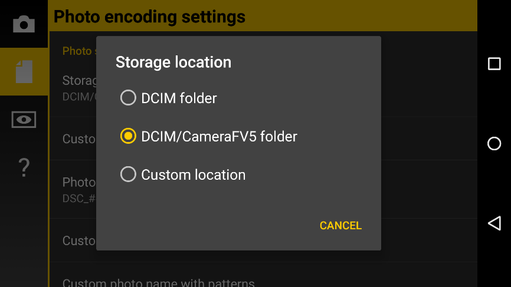

# Storage folders

To change the storage folder, go to `Settings > Photo encoding settings > Photo storage & Numbering > Storage location`. There you can choose the following options:

* __DCIM folder.__ Photos will be saved to _<Internal memory storage>/DCIM_ folder.
* __DCIM/CameraFV5 folder.__ Photos will be saved to _<Internal memory storage>/DCIM/100_CFV5_ folder. That is the default option.
* __Custom location.__ You will be required to provide a custom folder in the Custom storage folder setting. If you don’t set that setting, DCIM/CameraFV5 option will be used instead.

In `Settings > Photo encoding settings > Photo storage & Numbering > Custom storage folder` you can set a custom folder to store your pictures (remember to set the Storage location setting to Custom location). A folder browser will open that will let you navigate around your folder structure. Tap Select to define the current selected folder as the storage folder.

!!! note
    There’s no universal location of the external SD card location. As the internal memory, the external SD card is shown on the device file system as a normal folder. Usually is called _externalSD_ or _extSdCard_, and its location varies across devices (_/sdcard/_ or _/mnt/_ folders are typical but not the only ones).