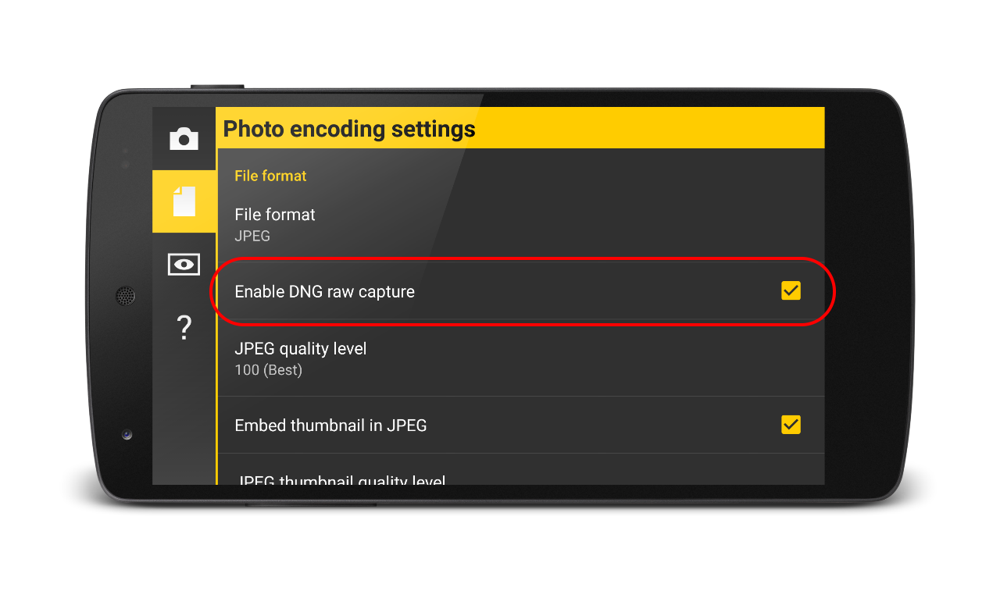

# How to enable RAW capture

First, ensure that you have Camera FV-5 2.2 or newer. If your phone supports RAW capture and you are running, follow these steps to enable RAW capture.

1. Open the **Settings** panel (tap on the cog icon on the top left corner of the screen).
2. Select the **Photo encoding settings** tab (2nd).
3. Enable the option **Enable RAW capture**.

When you enable RAW capture, you will get JPEG+DNG (i.e. both developed and raw images). The RAW photos are stored as DNG files. The file names match the ones of the JPEG files that you can completely customize. Also, DNG files are stored on the same folder used to store the JPEG images, and you can choose any folder on your internal memory to store your pictures.

!!! note
    RAW images are processed in the background, and take substantially longer to write, since the raw image sizes are considerably bigger than JPEG images.
