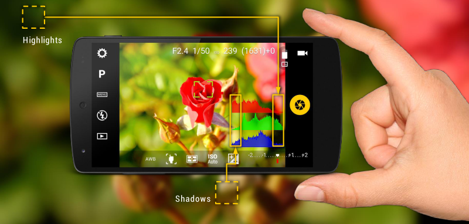

# Live histogram

The histogram is a powerful guide to evaluate a photo exposure.

A histogram is a graph that counts how many occurrences of a particular brightness channel has. In case of color photos, there are three color channels (red, green and blue) each with its own intensities, whereas in black and white images there’s only one luminance channel. Also, even with color images, you can opt to get a luminance-only histogram. Internally, the picture is converted to grayscale to calculate the histogram.

## Activating the live histogram

Go to `Settings > Viewfinder > Live histogram` and activate **Show histogram**. The histogram is calculated in real time and changes when you move the camera or the subject, or you change settings that affect the lightning or color distribution.

## Histogram types

In `Settings > Viewfinder > Live histogram > Histogram type` you can select:

* __RGB (3 color channels).__ This option is only available when taking color photos.
* __Luminance.__ This option is also available when taking color photos. It shows the luminance histogram of the viewfinder converted to grayscale.

Furthermore, you can adjust the size of the graphs in **Histogram size** (**Normal** and **Mini**) and the style of the histogram in **Histogram style** (**Transparent** or **Solid**).
